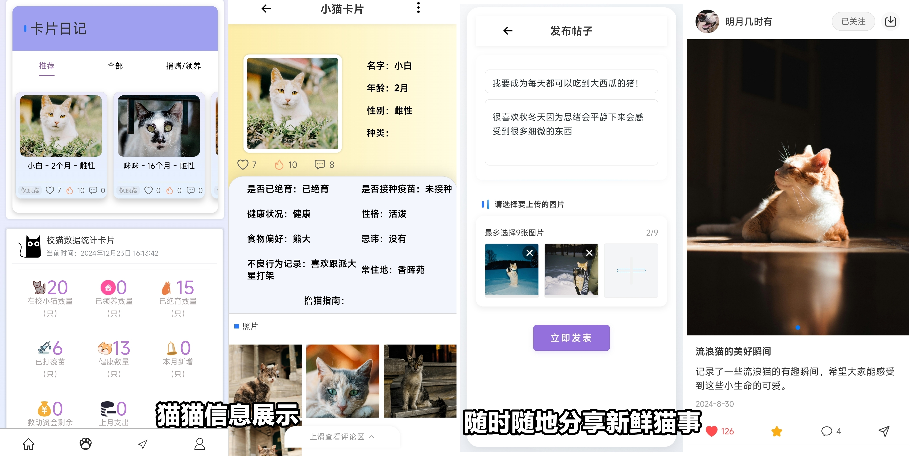
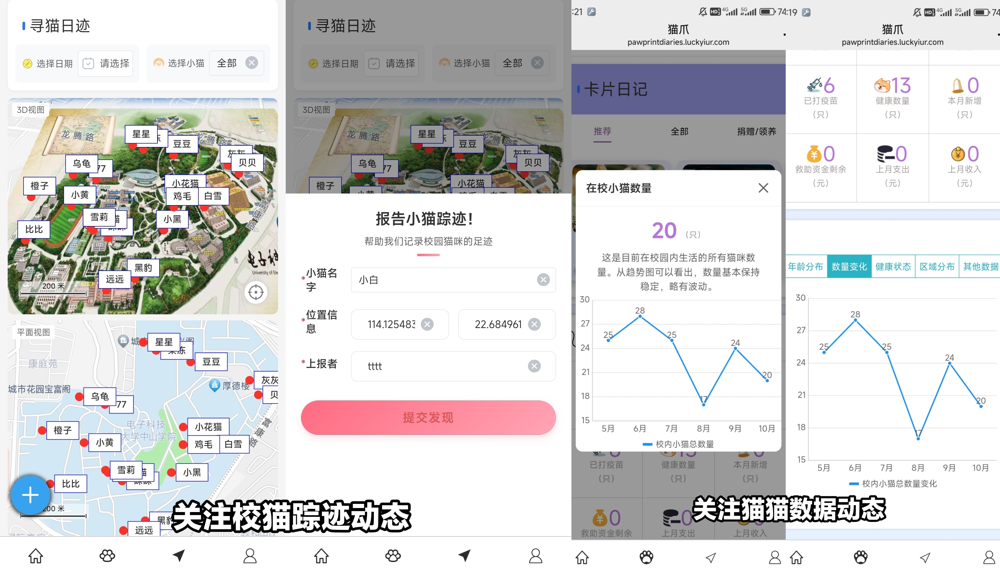
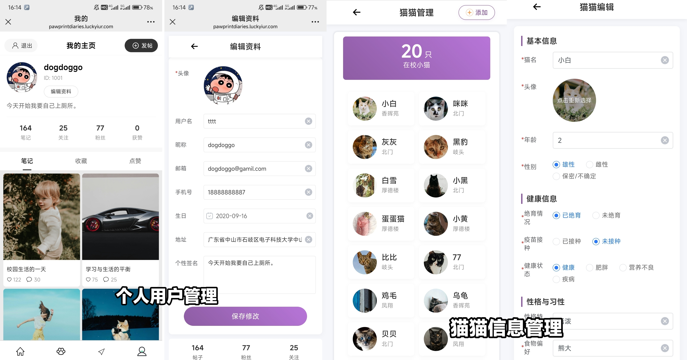
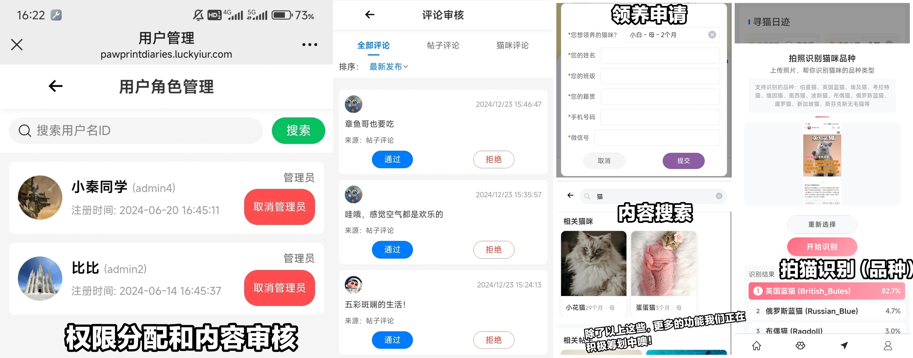

# 🐾 校猫日记 PawprintDiaries-H5

<div align="center">

**一个基于 Vue3 和 uni-app 开发的校园猫咪管理与社交平台**

[](https://opensource.org/licenses/MIT)
[](https://vuejs.org/)
[](https://uniapp.dcloud.io/)
[](https://www.typescriptlang.org/)

[在线体验](https://pawprintdiaries.luckyiur.com) | [前端代码](https://github.com/vikis77/PawprintDiaries-H5) | [后端代码](https://github.com/vikis77/PawprintDiaries-SpringBoot) | [开发者博客](https://luckyiur.com) | [项目演示视频](https://www.bilibili.com/video/BV1iJA2e4EZ3/?spm_id_from=333.1387.homepage.video_card.click&vd_source=93ed68d6c3cef9d567969b4d3c9d0437)

</div>

## 📖 项目简介

校猫日记是一个结合校园流浪猫救助管理和社交分享的社区平台，通过记录和分享学校流浪猫的信息，连接爱猫人士，共同为猫猫创造更好的生活环境。帮助校园内的猫咪志愿者更好地管理和关爱流浪猫，为救助工作提供信息支持，为学校管理提供数据参考。

## ✨ 功能特性

### 🐱 猫咪管理
- **信息记录**: 记录和管理流浪猫的基本信息，如照片、健康状况和活动范围
- **时间轴功能**: "小猫时间轴"记录管理每个小猫发生的关键事件
- **便捷查看**: 提供便捷的界面，方便用户查看信息，方便管理方记录管理
- **品种识别**: 目前已实现猫猫品种的拍照识别功能

### 🤖 AI 智能助手
- **智能问答**: AI智能问答助手，可以快速回答校猫相关问题
- **多模型支持**: 基于 Dify 搭建，集成 ChatGPT 4o mini、DeepSeek-V3、DeepSeek-R1 等多种模型
- **RAG 检索**: 支持 RAG 检索，结合知识库优化问答效果

### 📱 社交分享
- **帖子发布**: 用户可以发布自己的帖子，分享和查看猫咪的照片和日常故事
- **互动功能**: 类似于社交平台的分享模式，增强用户之间的互动
- **评论点赞**: 支持用户之间的评论点赞功能，支持给小猫、帖子进行点赞

### 🏠 领养救助
- **领养申请**: 支持用户发起领养申请
- **爱心捐赠**: 提供爱心捐赠入口
- **资金管理**: 提供爱心救助组织资金管理功能，包括资金数据的记录和可视化数据分析

### 🗺️ 地图追踪
- **位置记录**: 通过地图功能跟踪和记录流浪猫的活动路径
- **用户上传**: 支持用户上传跟踪记录
- **高德地图**: 基于高德地图 JS SDK API 实现

### 📊 数据分析
- **可视化分析**: 提供流浪猫数量和分布等数据的可视化分析
- **图表展示**: 使用 uCharts 图表库展示数据

### 🛡️ 内容管理
- **内容审核**: 对用户发布的帖子和评论进行审核，只有审核通过的内容才会公开展示
- **角色管理**: 多角色权限管理，不同角色拥有不同权限
- **内容搜索**: 支持对平台的公开帖子和校猫进行搜索

## 📸 项目截图

<div align="center">

| 首页 | 猫咪详情 | 发布帖子 |
|:---:|:---:|:---:|
|  |  |  |

| AI 问答 | 地图功能 |
|:---:|:---:|
|  |  |

</div>

## 🛠️ 技术栈

### 前端技术
- **框架**: Vue 3.4.21 + TypeScript 5.3.3
- **跨端开发**: uni-app 2.0.2 (支持 H5、小程序、APP)
- **UI 组件库**: uView UI 2.0.37 + uni-ui
- **状态管理**: Pinia 2.1.7 + pinia-plugin-persistedstate
- **路由管理**: Vue Router 4.4.3
- **图表库**: uCharts (@qiun/vue-ucharts)
- **地图服务**: 高德地图 JS SDK API (@amap/amap-jsapi-loader)
- **HTTP 请求**: Axios 1.7.7
- **工具库**: JWT-decode、QRCode 生成

### AI 智能助手
- **平台**: 基于 Dify（生成式 AI 应用创新引擎）搭建 AI Workflow 编排
- **检索增强**: 支持 RAG 检索，结合知识库优化问答效果
- **多模型支持**: 集成 ChatGPT 4o mini、DeepSeek-V3、DeepSeek-R1 等多种模型 API

### 开发工具
- **构建工具**: Vite + Vue CLI Service
- **代码规范**: TypeScript + ESLint
- **自动导入**: unplugin-auto-import + unplugin-vue-components

## 🚀 快速开始

### 环境要求
- Node.js 16.0+
- npm 或 yarn 包管理器
- HBuilderX (推荐)

### 安装步骤

1. **克隆项目**
```bash
git clone https://github.com/vikis77/PawprintDiaries-H5.git
cd PawprintDiaries-H5
```

2. **安装依赖**
```bash
npm install
# 或
yarn install
```

3. **配置环境**
```bash
# 复制配置模板文件
cp src/config/index.js.template src/config/index.js
# 编辑配置文件，填入你的 API 地址等配置信息
```

4. **启动开发服务器**

**方式一：命令行启动**
```bash
npm run dev:h5
```

**方式二：HBuilderX 启动（推荐）**
- 使用 HBuilderX 打开项目
- 点击"运行" -> "运行到浏览器" -> "Chrome"

5. **访问应用**
```
http://localhost:8080
```

### 构建部署

```bash
# 构建 H5 版本
npm run build:h5

# 构建产物在 unpackage/dist/build/h5 目录下
```

## 📁 项目结构

```
PawprintDiaries-H5/
├── src/                      # 源代码目录
│   ├── api/                  # API 接口定义
│   ├── components/           # 全局通用组件
│   ├── config/              # 配置文件
│   ├── constant/            # 常量定义
│   └── utils/               # 工具函数
├── pages/                   # 页面文件
│   ├── Home.vue            # 首页
│   ├── CatManage.vue       # 猫咪管理
│   ├── Post.vue            # 帖子页面
│   ├── ChatBot.vue         # AI 聊天
│   ├── Map.vue             # 地图功能
│   └── ...                 # 其他页面
├── components/              # 页面组件
│   ├── BottomNav.vue       # 底部导航
│   └── MyChartComponent.vue # 图表组件
├── static/                  # 静态资源
├── uni_modules/            # uni-app 插件
├── store/                  # 状态管理
├── router/                 # 路由配置
├── types/                  # TypeScript 类型定义
├── manifest.json           # uni-app 配置
├── pages.json             # 页面配置
├── vite.config.js         # Vite 配置
└── package.json           # 项目配置
```

## 🔧 配置说明

### 环境配置

项目使用 `src/config/index.js` 进行环境配置，支持开发环境和生产环境的不同配置：

```javascript
// 开发环境配置
if (process.env.NODE_ENV === 'development') {
    API_general_request_url.value = "http://localhost:8080"
    pic_general_request_url.value = "你的图片服务器地址"
}
```

### 主要配置项
- `API_general_request_url`: 后端 API 地址
- `pic_general_request_url`: 图片资源 CDN 地址
- `Suffix_1000/1001/1002`: 图片压缩后缀配置（可以根据自己需求更改）

## 📝 更新日志

### v1.0.0 (2025-01-XX)
- ✨ 基础功能完成
- 🐱 猫咪信息管理系统
- 📝 帖子发布与评论系统
- 🤖 AI 智能问答助手
- 📍 地图位置追踪功能
- 💰 捐赠管理系统
- 🛡️ 内容审核与权限管理

## 📄 许可证

本项目采用 [MIT License](LICENSE) 许可证。

## 🙏 致谢

- [Vue.js](https://vuejs.org/) - 渐进式 JavaScript 框架
- [uni-app](https://uniapp.dcloud.io/) - 跨端开发框架
- [uView UI](https://www.uviewui.com/) - 全面兼容 nvue 的 uni-app 生态框架
- [高德地图](https://lbs.amap.com/) - 地图服务提供商
- [Dify](https://dify.ai/) - 生成式 AI 应用创新引擎

## 📞 联系方式

- **项目地址**: [GitHub](https://github.com/vikis77/PawprintDiaries-H5)
- **后端项目**: [PawprintDiaries-SpringBoot](https://github.com/vikis77/PawprintDiaries-SpringBoot)
- **在线体验**: [https://pawprintdiaries.luckyiur.com](https://pawprintdiaries.luckyiur.com)
- **开发者博客**: [https://luckyiur.com](https://luckyiur.com)
- **项目演示视频**: [Bilibili](https://www.bilibili.com/video/BV1iJA2e4EZ3/?spm_id_from=333.1387.homepage.video_card.click&vd_source=93ed68d6c3cef9d567969b4d3c9d0437)

---

<div align="center">

**如果这个项目对你有帮助，请给个 ⭐ Star 支持一下！**

Made with ❤️ for stray cats

</div>

